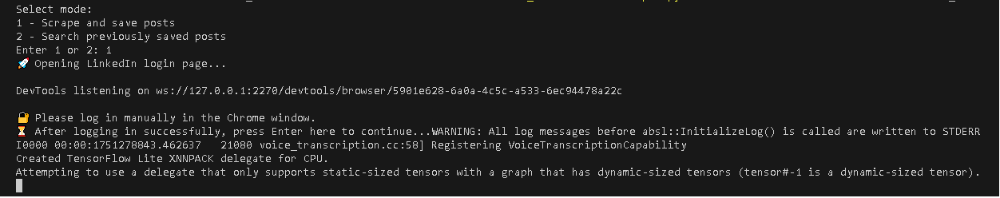

# Linkedin_Saved_Posts_Search

A simple Python CLI tool to scrape, search, and export your LinkedIn saved posts.
This tool is ideal for users who want to organize, revisit, and export content from the posts they’ve saved on LinkedIn.

## ❔ Motivation

Chances are, you like me, have tried to sublimate your uncontrollable desire to scroll social media posts, one after another. A while back, I realized that in order for me to find a specific post which I saved two months ago, daunting manual scroll through my Linkedin saved posts tab is required. For this personal use case, which I believe many of Linkedin users share since Linkedin lacks the native search functionality for your saved posts, I decided to create this CLI tool to let users scrape their saved posts and their meta-data, search them and optionally export the resulted URLs in a json file. 

## 🚀 Features

🔐 Manual login via browser (with your Linkedin Username and Password)

🧠 Continue scraping in visible/headless mode after login

📝 Extracts:

    Full post text

    Author name

    Timestamp (date posted)

🔍 Search with:

    Fuzzy keyword matching (RapidFuzz)

    AND/OR logic

    Optional date range filter

📤 Export matched results to a structured JSON file


## 📦 Installation

Install the CLI tool directly from PyPI:

```  
pip install linkedin-saved-posts-search
```

## 🛠️ Usage

*Step 1: Start the CLI*
```
Lsps
```
*Step 2: Mode Selection*
You will be prompted to select a mode.(1-scape or 2-search) <br>
If this is your first run, select mode 1. (In mode 2, the script looks for saved_posts.json and saved_urls.json; you have to scrape these data first.) <br>


*Step 3: Login*

 You will be prompted to log in through a browser.<br>
🔐 Note: Only standard LinkedIn login (username and password) is supported. Google or Apple login methods are not currently supported.<br>


