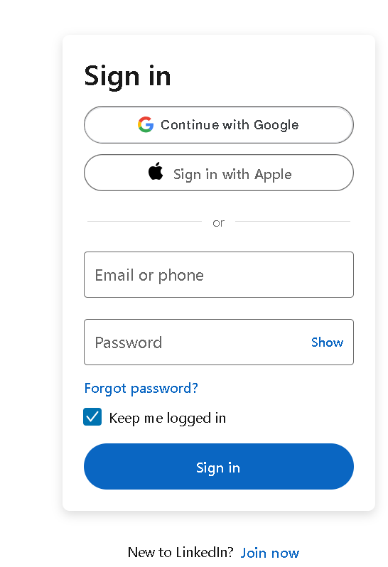
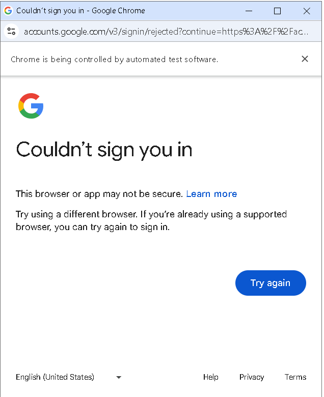
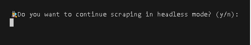
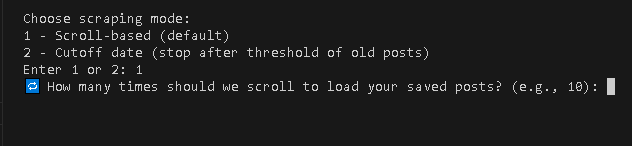
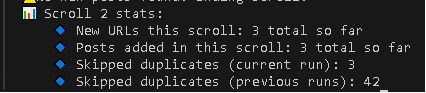
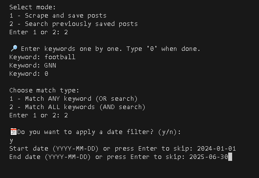
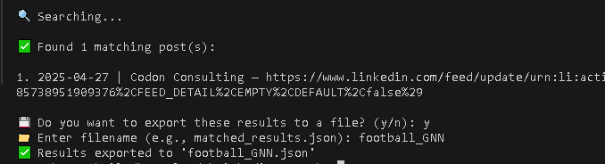

# Linkedin_Saved_Posts_Search

A simple Python CLI tool to scrape, search, and export your LinkedIn saved posts.
This tool is ideal for users who want to organize, revisit, and export content from the posts they’ve saved on LinkedIn.

## ❔ Motivation

Chances are, you like me, have tried to sublimate your uncontrollable desire to scroll social media posts, one after another. A while back, I realized that in order for me to find a specific post which I saved two months ago, daunting manual scroll through my Linkedin saved posts tab is required. For this personal use case, which I believe many of Linkedin users share since Linkedin lacks the native search functionality for your saved posts, I decided to create this CLI tool to let users scrape their saved posts and their meta-data, search them and optionally export the resulted URLs in a json file. 

## 🚀 Features

🔐 Manual login via browser (with your Linkedin Username and Password)

🧠 Continue scraping in visible/headless mode after login

📝 Extracts:

    Full post text

    Author name

    Timestamp (date posted)

🔍 Search with:

    Fuzzy keyword matching (RapidFuzz)

    AND/OR logic

    Optional date range filter

📤 Export matched results to a structured JSON file


## 📦 Installation

Install the CLI tool directly from PyPI:

```  
pip install linkedin-saved-posts-search
```

## 🛠️ Usage

*Step 1: Start the CLI*
```
Lsps
```
*Step 2: Mode Selection*
You will be prompted to select a mode.(1-scape or 2-search) <br>
If this is your first run, select mode 1. (In mode 2, the script looks for saved_posts.json and saved_urls.json; you have to scrape these data first.) <br>


*Step 3: Login*

 You will be prompted to log in through a browser.<br>




🔐 Note: Only standard LinkedIn login (username and password) is supported. Google or Apple login methods are not currently supported.<br>



🔐 Note: Please remember to press **Enter** in the terminal after successful manual login to continue.
 
 *Step 4: Headless option *

 You'll have the option to either continue scaping in the visible launched chrome browser or switch to headless mode.

 

 *Step 5: Scrape mode selection*

 You'll be prompted to choose between the scroll-based(default) or cut-off date scraping.
 In the following example, we've chosen the default mode. Next, we'll be asked the number of times the script needs to scroll and scrape.
 🔐 Note: In the cut-off mode, you'll be prompted to enter a cut-off date in the format(YYYY-MM-DD).

 

 If successful, you'll see an output similar to the following:

 

 *Step 6: Search mode*

 After your initial run, you can use the search mode to sift through your scraped saved posts. 
🔐 Note: Idempotency has been implemented in the scraping function. If re-run, the scraper tries to scrape any saved posts that hasn't been scraped previously.

You'll be prompted to enter keywords.
🔐 Note: Type **0** as your last keyword to signal the end of input keywords.

You'll then asked to choose between AND/OR search functionality. 
You can optionally apply a filter date as well.(YYYY-MM-DD)



 *Step 7: Exporting the results*

 If the search function finds any matches, you'll see them printed in the format of i.[YYYY-MM-DD] | [Author Name] - [Ref URL].
 You'll then be prompted to decide whether to export the results into a json file.

 

 ## ⚠️ Limitations

 ❌ Login with Google, and Apple is currently not supported due to their automatic bot detection. This can be remedied through getting user-data-dir session info for authentication. A better option can be a chrome plugin extension which handles security tokens properly in the backend. Stay tuned for the release of the extension version of this tool in the near future!

 ⏳ Depending on how many posts you’ve saved and the timeline(or number of scrolls) that you wish to go back, scraping might take long to run.(I had something close to 1700s saved posts in the last 3 years and it took the script around 40 minutes to run)
 Good news is, once you run the scraper to collect your saved posts and their URLs way back in time, for future runs, it will only take a short time to scrape recent unseen saved posts.

 🖥️ This tool is designed for personal use and not intended for large scale/unethical scraping. I've assumed the users' saved posts contain other Linkedin users' publicly published posts. Please refrain from scraping privately shared materials.


## 🧪 Future Direction

This CLI tool is the foundation for a more accessible Chrome Extension version.
Stay tuned — soon, you’ll be able to search your saved posts directly inside LinkedIn with a seamless UI!


